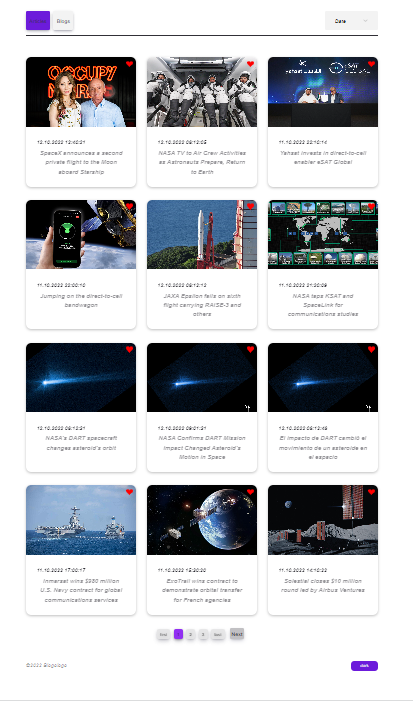
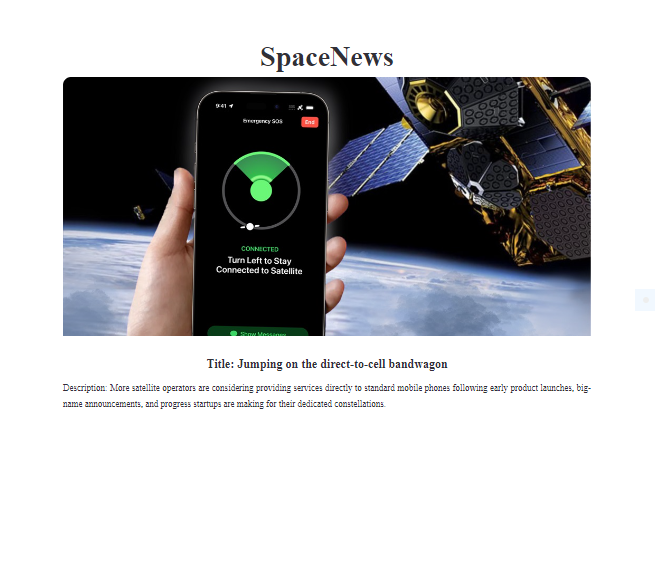
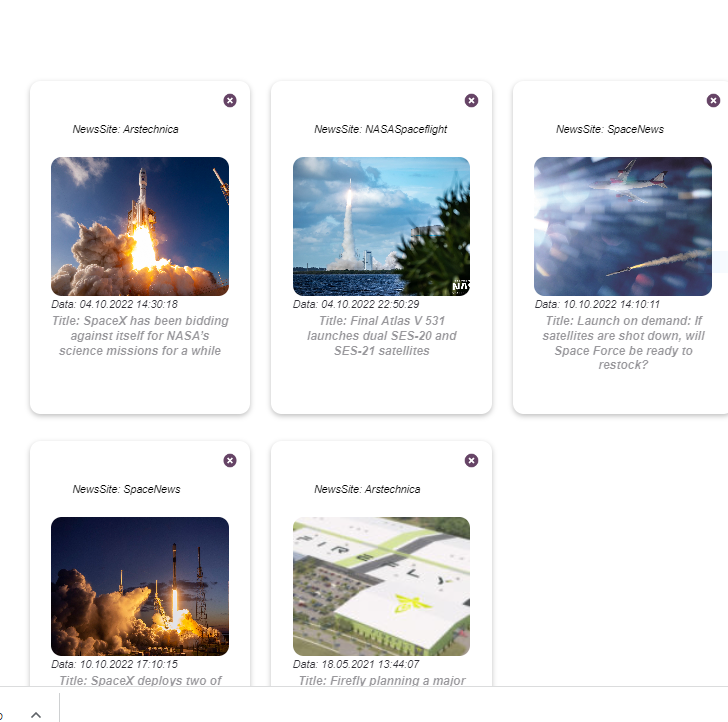
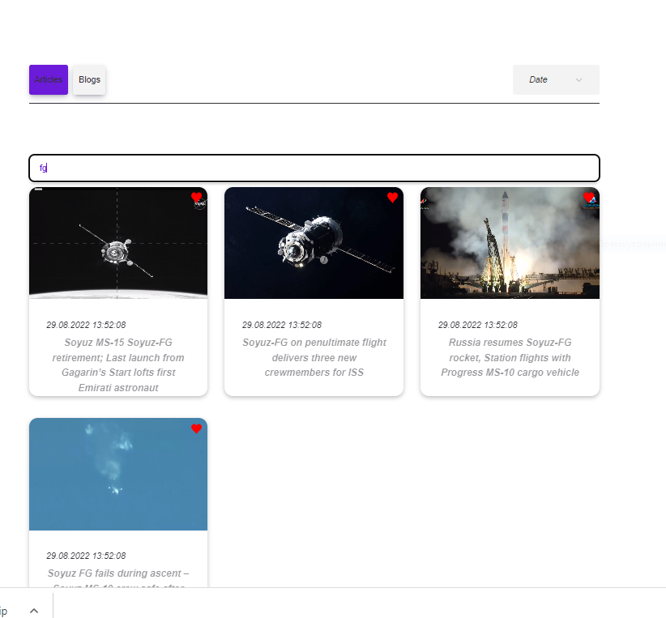

<h1 align="center">
  <a href="https://github.com/mishania2022/blogologo">
    
  </a>
</h1>

<div align="center">
  BlogoLogo - web-application 
  <br />
  <br />
  <a href="https://mishania2022.github.io/blogologo/">View Demo</a>
</div>

<details>
  <summary>Table of Contents</summary>
  <ol>
    <li>
      <a href="#about">About</a>
      <ul>
        <li><a href="#built-with">Built With</a></li>
      </ul>
    </li>
    <li>
      <a href="#getting-started">Getting Started</a>
      <ul>
        <li><a href="#installation">Installation</a></li>
      </ul>
    </li>    
    <li><a href="#usage">Contact</a></li>
    <li><a href="#contact">Contact</a></li>
  </ol>
</details>

## About

An application for finding articles and blogs about space. There is a huge collection of articles available to read. To find the desired article, you need to enter keywords in the search, for example, the title of the article.


### Built With

- [![Typescript][typescriptlang.org]][typescript-url]
- [![React][react.js]][react-url]
- [![Axios][axios-http.com]][axios-url]
- [![Firebase][firebase.google.com]][firebase-url]
- [![Redux Toolkit][redux-toolkit.js.org]][redux-url]
- [![React Hook Form][react-hook-form.com]][react-hook-form-url]
- [![styled-components][styled-components]][styled-components-url]
- [![React Router][reactrouter.com]][react-router-url]
- [![Framer Motion][framer.com]][framer-url]
- [![React Spinners][react-spinners]][react-spinners-url]
- [![React Tabs][react-tabs]][react-tabs-url]

## Getting Started

Just install the project to see how it works.

### Installation

1. Clone the repo
   ```sh
   git clone https://github.com/mishania2022/blogologo.git
   ```
2. Install NPM packages

   ```sh
   npm install
   ```
## Usage

You can see the first 12 articles or blogs.



Нou can read the article in detail



Your favorite articles and blocks



Articles search




## Contact

Mihail Kirpichov - (https://github.com/mishania2022) - mishania261282@mail.ru

Project Link: [https://github.com/mishania2022/blogologo](https://github.com/mishania2022/blogologo)


[typescriptlang.org]: https://img.shields.io/badge/-Typescript-blue?style=for-the-badge&logo=typescript&logoColor=white
[typescript-url]: https://www.typescriptlang.org/
[react.js]: https://img.shields.io/badge/React-20232A?style=for-the-badge&logo=react&logoColor=61DAFB
[react-url]: https://reactjs.org/
[axios-http.com]: https://img.shields.io/badge/-axios-671ddf?style=for-the-badge&logo=axios&logoColor=white
[axios-url]: https://axios-http.com/ru/docs/intro
[firebase.google.com]: https://img.shields.io/badge/-firebase-5f6368?style=for-the-badge&logo=firebase&logoColor=orange
[firebase-url]: https://firebase.google.com/docs/
[redux-toolkit.js.org]: https://img.shields.io/badge/-redux--toolkit-764abc?style=for-the-badge&logo=redux&logoColor=white
[redux-url]: https://redux-toolkit.js.org/
[react-hook-form.com]: https://img.shields.io/badge/-react--hook--form-1e2a4a?style=for-the-badge&logo=react-hook-form&logoColor=ec5990
[react-hook-form-url]: https://react-hook-form.com/
[github.com/rt2zz/redux-persist]: https://img.shields.io/badge/-redux--persist-persist?style=for-the-badge
[persist-url]: https://github.com/rt2zz/redux-persist#readme
[styled-components]: https://img.shields.io/badge/-styled--components-35495E?style=for-the-badge&logo=styled-components&logoColor=pink
[styled-components-url]: https://styled-components.com/
[framer.com]: https://img.shields.io/badge/-framer--motion-DD0031?style=for-the-badge&logo=framer&logoColor=black
[framer-url]: https://www.framer.com/
[react-select.com]: https://img.shields.io/badge/-react--select-FF3E00?style=for-the-badge
[react-select-url]: https://react-select.com/home
[reactrouter.com]: https://img.shields.io/badge/-react--router-563D7C?style=for-the-badge&logo=react-router&logoColor=white
[react-router-url]: https://reactrouter.com/
[react-spinners]: https://img.shields.io/badge/react--spinners-yellow?style=for-the-badge
[react-spinners-url]: https://www.davidhu.io/react-spinners/
[react-tabs]: https://img.shields.io/badge/react--tabs-black?style=for-the-badge
[react-tabs-url]: https://reactcommunity.org/react-tabs/


